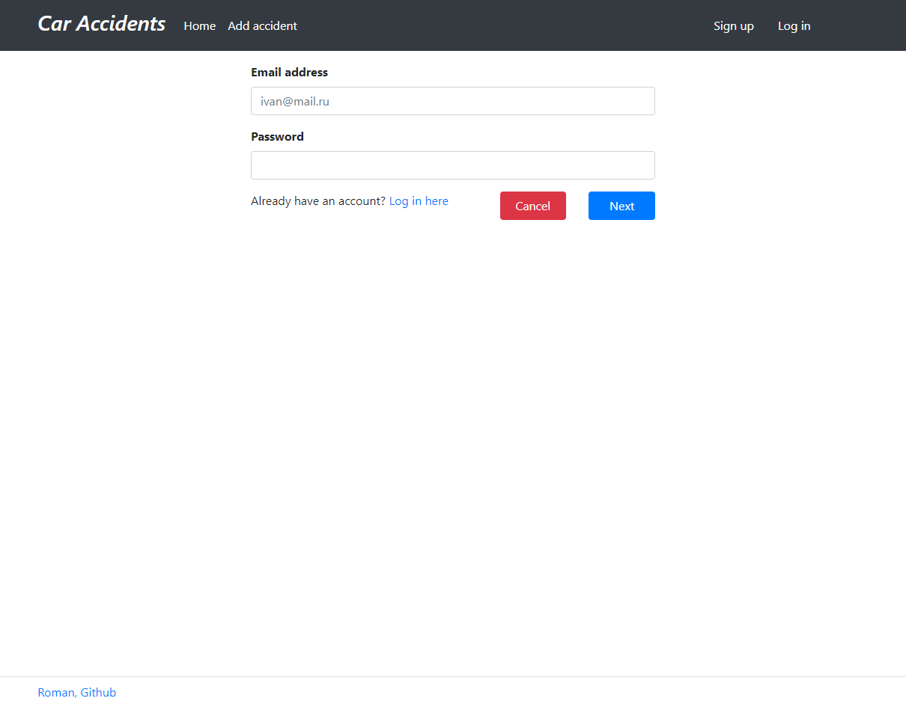
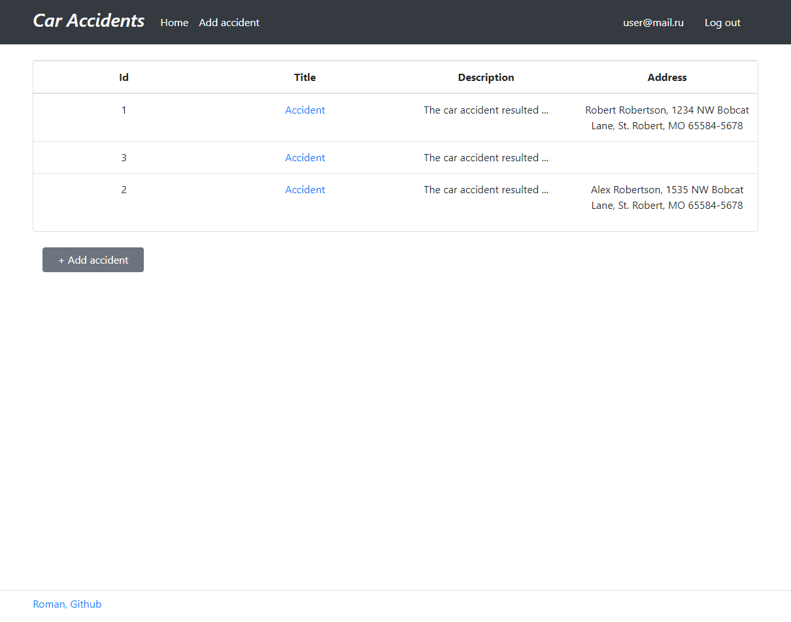
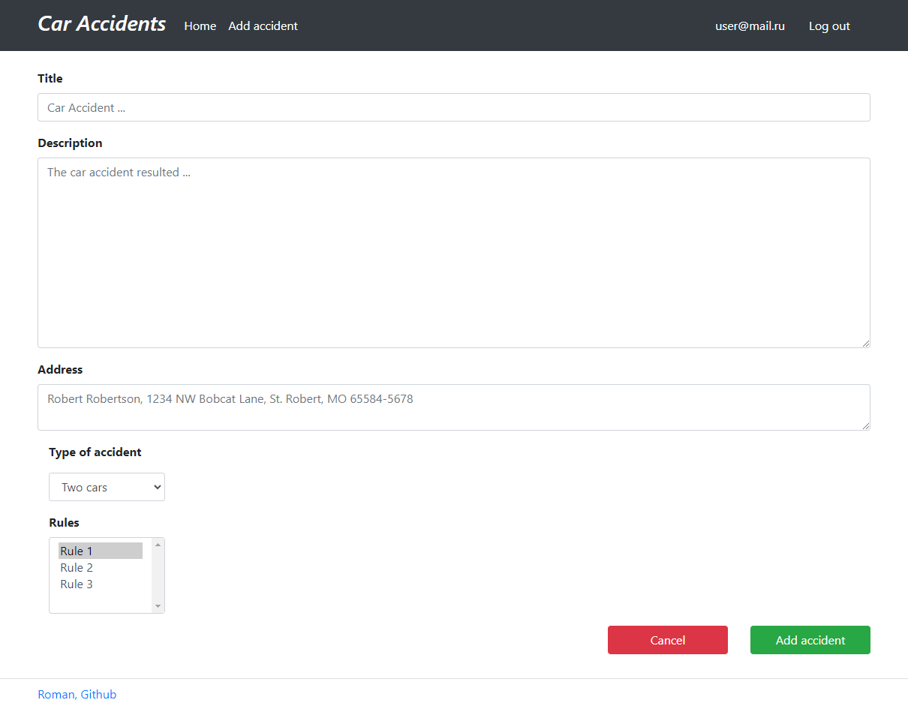
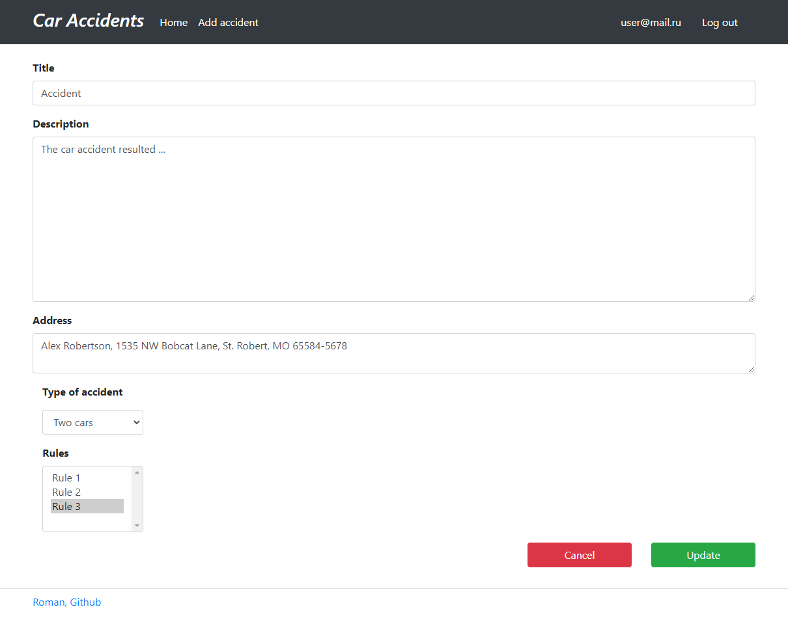
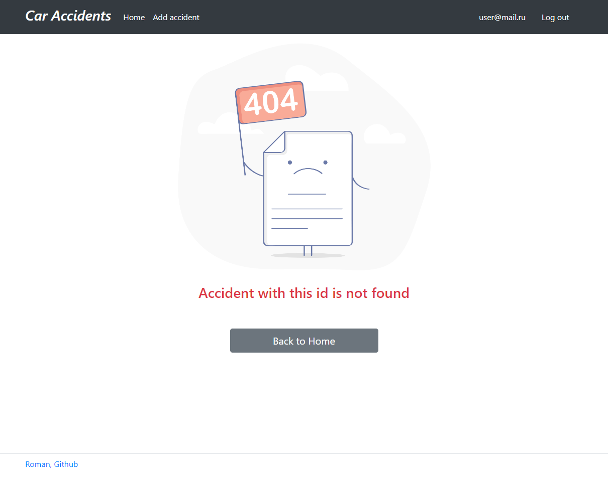

# Accidents
A simple website for monitoring car infractions.
There are two roles in the system. Normal users and traffic officers.
The user adds a description of the accident.

### The main logic of the App:

* User registration, log in, log out
* Displaying all accidents
* When you click on accident-task, you are taken to a page with a detailed description of the task
* Create / update / delete accident
* Selection of type of accident
* Selection the type of accident article

### Used technologies:
* Java 17
* Spring Boot 2.7.3
* Spring Data Jpa 2.7.6
* Spring Security 5.7.5
* Maven 3.9.5
* PostgreSQL 16
* Lombok 1.18.22
* Junit 5.8.2
* AssertJ 3.22.0
* Mockito 4.5.1
* Liquibase 4.15.0
* Thymeleaf 2.7.3
* Bootstrap 4.1.3
* JoCoCO 0.8.7
* H2database 2.1.214
* Checkstyle 10.12.5

### Environment Requirements:
* JDK 17
* Maven 3.9.5
* PostgreSQL 16

### How to run the project:

- To run the project, you need to clone the project from this repository;
- Then you need to create a local database "accidents";
- Specify the login and password for the database you created in the db/liquibase.properties file;
- Run liquibase to pre-create and autofill tables;
- Launch the application through the Main class, located in the folder src\main\java\ru\job4j\accidents\Main;
- Open the page http://localhost:8080/index in the browser;

---

## Application screenshots

### Sign up page

### Login page

### All accidents

### Add accident

### Edit task

### Error page
